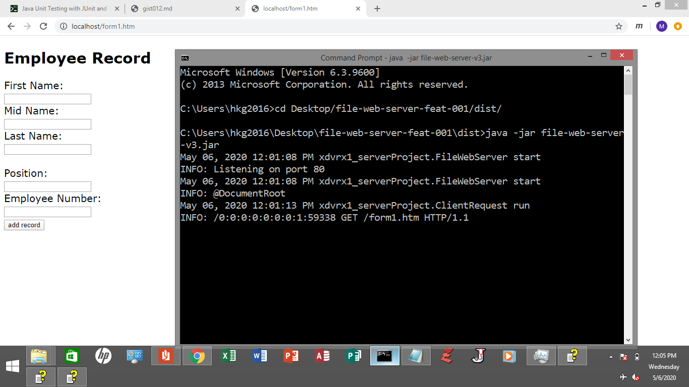

# Lightweight Web Server 

***

I'm happy to share with you my custom server written in Java.

Network programming is very important. Remember that the Internet
was created for that very reason: that is, computers
must communicate to one another around the world and 
data must arrive as soon as possible.

Unlike C, in Java you don't need to do much complexity, Java
does that exactly. But remember, data will always end as bytes.
So, everything can be processed by a computer as long as the 
programmer can represent the data as bytes.

Remember that both servers and
browsers can pass data to one another, but typically a browser will always
initiate the connection while the server is just always waiting for a connection.
The same is true for other servers like Telnet or FTP servers.

Yet, HTTP is good also to pass any data as long
as it is expressed in bytes. HTTP is so famous now as it is the protocol of
web servers and browsers, so more often, we always link HTTP for web sites.
Also, updated browsers nowadays can display more than text documents like PDF and
images and even markdown files.

Also, bytes are not even numbers, they are just representation for us humans because
a computer can only understand the presence or absence of an electrical pulse: that
is, again, represented as 0 and 1. For today, of course, typical users will hate seeing
0s and 1s so programmers do the abstraction.

This server is enabled for GET and POST methods. Please see the instructions.

## Q&A

If you have questions, please feel free to ask me: 

<mongAlvarez@gmail.com>
   
You can also create a pull request to start the discussion or query/ies.

Or, you can raise an issue. I promise I will answer your questions. 

## Compiling & Using The Server

This is namespaced as package `xdvrx1_serverProject`. It is up to your IDE 
how it actually manages Java projects. 

Once you set this up correctly, the steps are:
1. Compile the project.
2. Run the project.
3. Put `index.html` to your working directory
and other sample files.
3. Open a browser.
4. Type in the address bar `localhost`.
5. See the default web page!
6. Access every file in that root directory
by typing the filename relative to that directory
or just create a list on the default web page.
7. If you are quite confused, you can download my release.

Remember also that the `index.html`
is the default web page, manually coded to do so. You can change that.

Once you created the executable jar file,
all files within the directory of this executable jar file
can be accessed through this server. 

As my example, in my release the executable jar file must
have its own folder, then inside that folder is the default page
`index.html`, then you can create subfolder, in my case, 
`data` and you can put files there to be serve by this webserver. 

And there is the form sample to post. When you click `add record`,
the data will be sent as POST.

## Contributing

1. Fork it!
2. Then, made changes and create a pull request. 
I'm much more willing to collaborate with you!

## License

MIT- the permissive license
